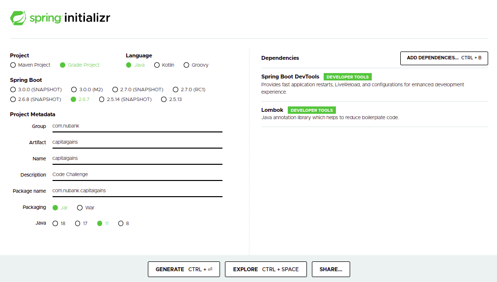
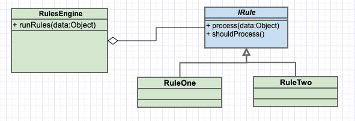
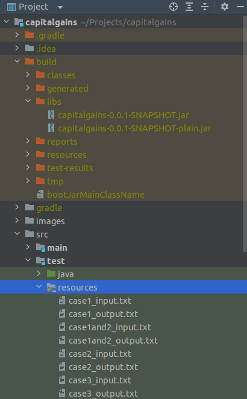
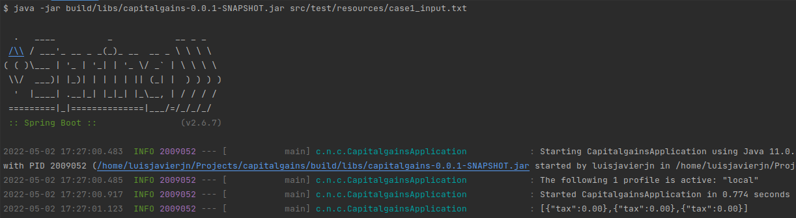
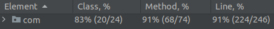

# Technical Description

This program was built on Ubuntu 20.04 using Java 11, SpringBoot and Gradle to handle dependencies. The initial code was generated through 
[start.spring.io](https://start.spring.io/)  
  

No Web dependencies were included because this is a command-line application, so the approach was to implement the interface 
CommandLineRunner and override the method **public void run(String... args)**. Four packages were created to support the logic 
of the application, namely: business, exceptions, model and utils, where the *business.rules* package handles the main responsibility 
applying the [Rules Design Pattern](https://levelup.gitconnected.com/rules-design-pattern-in-c-6c62f0e20ee0).  
  

Considering the previous image we can do the following matches  
- **RulesEngine:** this class is represented by the *TaxValidator* class using the method *validate*
- **IRule:** this class is represented by the *ITaxValidationRule* interface which has two methods to implement *IsValid* and *Execute*
- **RuleOne, RuleTwo and RuleThree:** these classes are represented by *BuyValidationRule*, *SellValidationRule* and *SellWithLossesValidationRule*

If there is another type of calculation for the taxes, we just create the *NewValidationRule* and add it to the list in *TaxValidator* 
for it to be evaluated like the rest. Because the topic this assigment is dealing with is about finance, the calculations were made 
using BigInteger and BigDecimal as Data Type. Moreover, when using the *Rules Design Pattern* we need to keep track of a certain *State* that 
can change as rules are being applied/validated according to the new information coming in, which in this case is every *Simulation* that 
is being read from the input files. Each Simulation comes with an *OperationType* (buy,sell), unit-cost and quantity, and when they are 
processed they can generate changes to the *State* which includes current quantity of stocks, the average price and/or any loss that can be 
deductible from capital gains. The classes *State*, *Simulation* and *OperationType* from the *model* package serve to this mechanism.  

On the other hand, for reading line by line the input data containing the simulations, a class *FileReaderUtil* was created, and it is part of 
*utils* package. *FileReaderUtil* is used by the *TaxService* class, which can be found in the *business* package and is in charge of 
taking from the input file one line at the time, which is the same as saying one simulation data at the time, and apply the corresponding 
rules to it. Because every line that describes a simulation is represented as a Jason array, the libraries *org.json* and *jackson.core* 
were included into the project so helper classes *JSONArray* and *ObjectMapper* could be used to handle the Json representation of the 
simulations in Java and for mapping that Json info to the *Simulation* java class. Then, the *TaxService* class returns through the method
*process* a String with all taxes that should be paid.  

Finally, from the main class *CapitalgainsApplication* the *TaxService* class is instantiated to process the input files and get a result 
printed by console. Even though, we can trust data is correct and coherent, some methods force to handle certain Exceptions, in these cases 
custom Exceptions were created to have control regarding what it is shown on console, namely: *InputStreamException* and *ReadLineException*, 
both of them part of the *exceptions* package.

# Compile and Run the Project

### Using gradle

To compile this project is as easy as running the following command:
```
gradle clean build
```
This creates a *build* folder, inside of it another folder called *libs* contains the .jar file, that's the executable file. And there are 
several input files into the *folder src/test/resources* to test out.


To execute the jar with the file *case1_input.txt* from the resource folder, run the following command:
```
java -jar build/libs/capitalgains-0.0.1-SNAPSHOT.jar src/test/resources/case1_input.txt
```
  

### Run tests cases

If what we want is just to run the test cases we can use the following command:
```
gradle test
```

To run the test from a specific class
```
gradle test --tests com.nubank.capitalgains.CapitalgainsApplicationTests
```

To run the test from a specific method inside a class
```
gradle test --tests com.nubank.capitalgains.CapitalgainsApplicationTests.testCase1
```

### Dockerfile

Run the following command to create the image *nubank/capital-gains*
```
sudo docker build -f Dockerfile -t nubank/capital-gains .
```

Now, there several way to run a container. The following is the simplest one, because it runs the jar using an input file by default called 
*example_input.txt* which can be found into the folder src/test/resources
```
sudo docker run --network host -it nubank/capital-gains
```

Another way is referencing some inputs file inside the folder src/test/resources because the whole project is copied inside the image
```
sudo docker run --network host -it nubank/capital-gains src/test/resources/case7_input.txt
```

And the more general case is by creating a volume to share information between the host and the container
```
sudo docker run --network host -v /home/luisjavierjn/Projects/capitalgains/src/test/resources:/usr/app/data -it nubank/capital-gains data/case7_input.txt
```

# Test Cases

There are test cases for every case mentioned in the assigment, all of them using the same approach as an integration test, calling the main method from 
the main class and asserting the last message captured by the LOGGER.info. The coverage is shown in the following image:  
  

